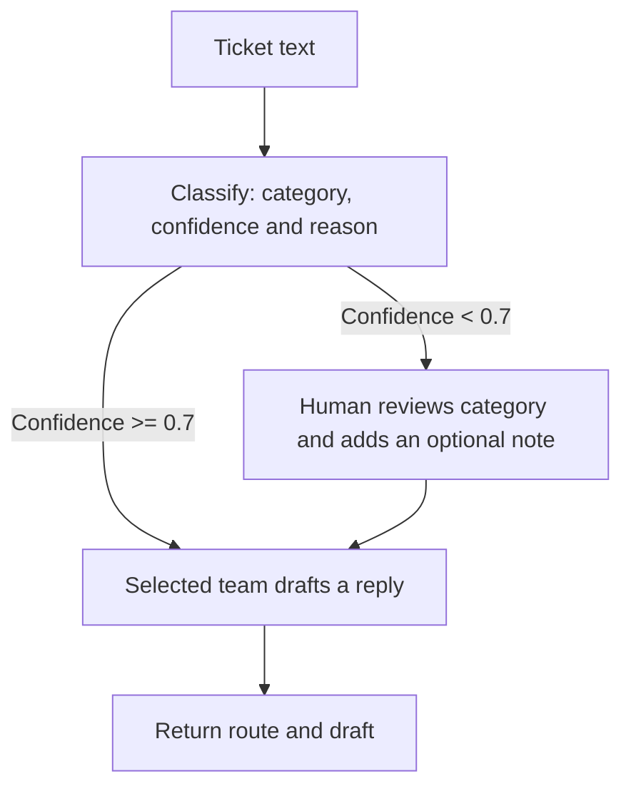

# Support Ticket Router

An AI workflow that classifies an online store's support tickets and drafts a reply
for the appropriate team. Clear tickets go straight to billing, technical support,
refunds or general customer care. Unclear tickets pause for a person to choose the
category and add guidance before the reply is drafted.


## What it does

For each ticket, the workflow returns a category, the model's confidence, a one-sentence
reason and a drafted customer reply.

| Category | Handles |
|---|---|
| Billing | Charges, invoices, payment methods, fees and price adjustments |
| Technical | Website or app errors, login problems and broken notifications |
| Refund | Returns, refunds for products and refund status |
| General | Delivery, stock, order changes and other store questions |

A message such as *"My card was charged twice"* can go directly to billing. A message
such as *"Nobody answers. Just fix it"* needs review: the person sees the original
ticket, the model's guess and its reason, then chooses a category or keeps the guess.
They can also leave a note, such as asking for the original ticket number.

Routing happens inside the application. It does not assign a ticket in an external
helpdesk or send the drafted reply to the customer.

## How routing works



Built with **LangGraph**: classification and drafting are separate steps, with a
pause/resume step for human review. The reviewer's category determines the final branch,
and their note guides the reply. A classifier refusal or unreadable response also goes
to review; API failures surface as errors.

The 0.7 threshold uses the model's own confidence score. It is a routing heuristic,
not a measured probability of correctness.

## Run locally

Requirements: Python 3.12+, [uv](https://docs.astral.sh/uv/) and an OpenAI API key.

```bash
git clone https://github.com/brkakyldz/support-ticket-router.git
cd support-ticket-router
uv sync
cp env.example .env
```

Set `OPENAI_API_KEY` in `.env`. The default model is `gpt-6-luna`; change it with
`OPENAI_MODEL`. Add `LANGSMITH_API_KEY` to enable tracing.

```bash
uv run ticket-route "My card was charged twice."
uv run ticket-route "Hi, I have a problem with my order."
```

If review is needed, the terminal asks you to choose a category and optionally leave
a note. It then prints the final route and drafted reply.

### Try the sample tickets

```bash
uv run ticket-samples
uv run ticket-samples --only T16 T20 --drafts
```

[`samples/tickets.json`](samples/tickets.json) contains 20 fictional tickets with
expected routes. Four are deliberately vague or combine problems; the sample runner
supplies their predefined reviewer decisions and compares the results with the
expected routes.

### Use LangGraph Studio

```bash
uv run langgraph dev
```

Open [Studio](https://smith.langchain.com/studio/?baseUrl=http://127.0.0.1:2024),
select `ticket_router` and submit a ticket in the `message` field. When the graph
pauses, resume with a category and an optional note:

```json
{"category": "general", "note": "Apologise and ask for the original ticket number."}
```


## Verification

```bash
uv run pytest
uv run python scripts/acceptance.py
uv run python scripts/acceptance.py --server  # also checks a running dev server
```

Offline tests cover routing, review/resume, decision validation and classifier failure
paths. Acceptance checks use the real model and LangSmith; the `--server` option also
checks the Studio API.

The recorded acceptance run on **2026-10-01** passed **6/6 checks**: 16 clear tickets
reached their expected branches, four ambiguous tickets paused and followed the
reviewer's choice, and server pause/resume and tracing checks passed.
[Full results](docs/acceptance-2026-10-01.txt).

<details>
<summary>LangSmith trace</summary>

With tracing enabled, runs appear in `support-ticket-router`. The trace shows the
classifier, selected branch and draft. Reviewed tickets resume on the same thread.


</details>

## Current scope

A local demo for a fictional online store. Tickets come from the terminal, sample file
or Studio. It has no email or helpdesk integration, ticket database, order lookup or
action that processes a refund. Replies are generated drafts for a person to review.

## License

[MIT](LICENSE)
