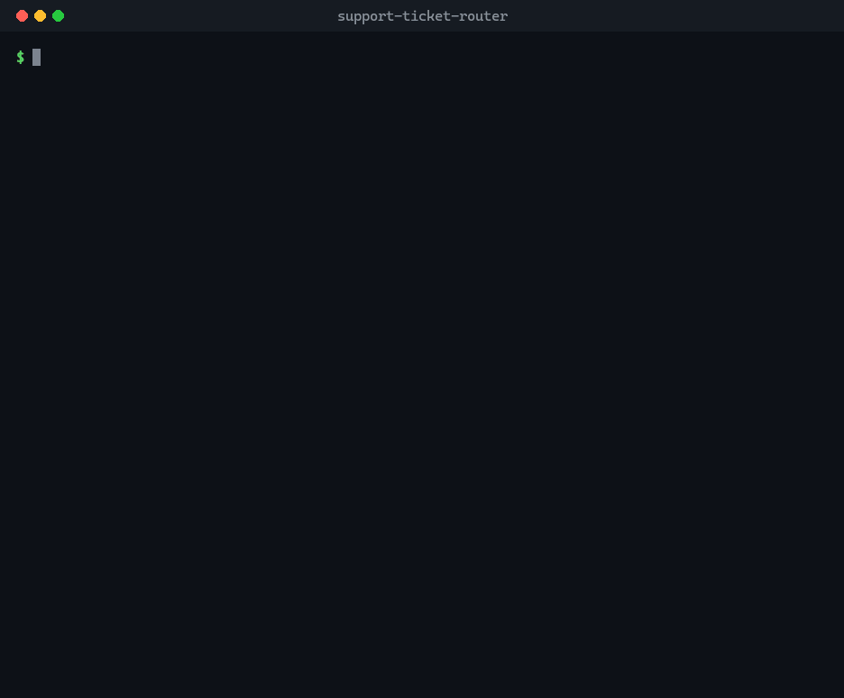
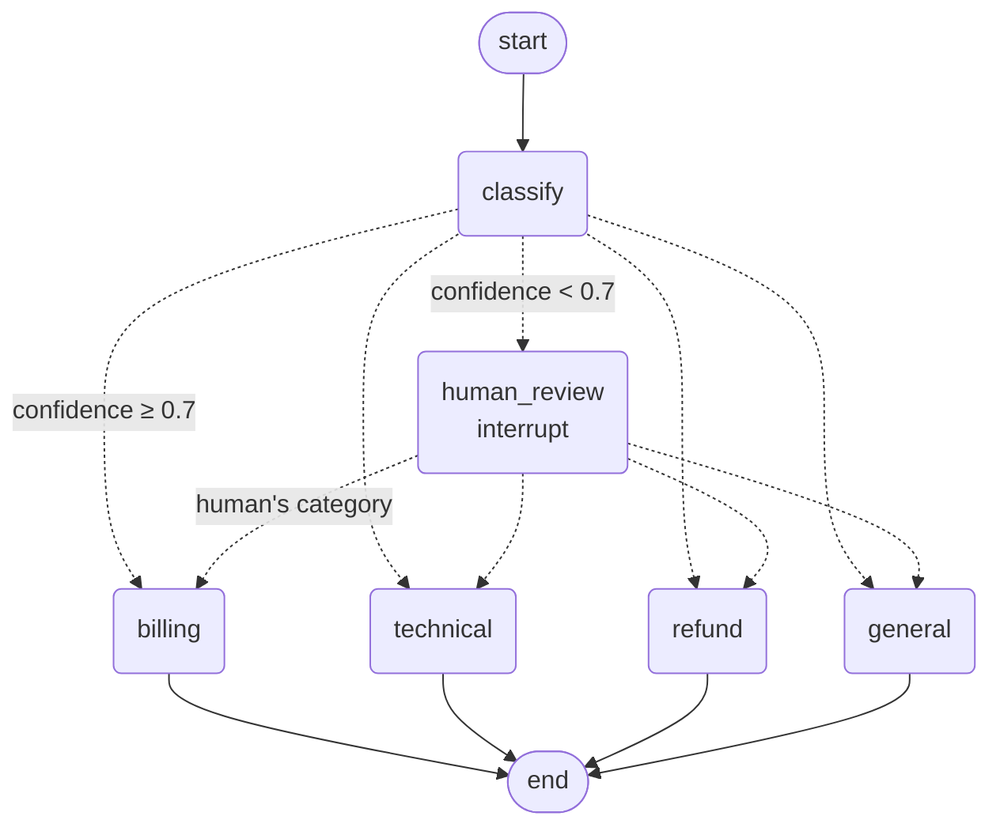
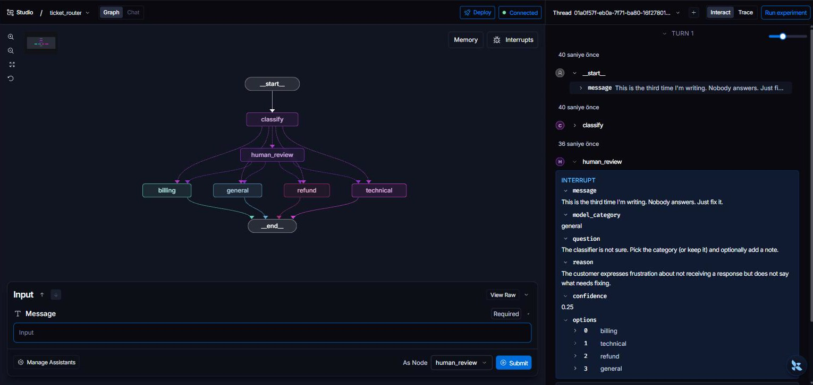
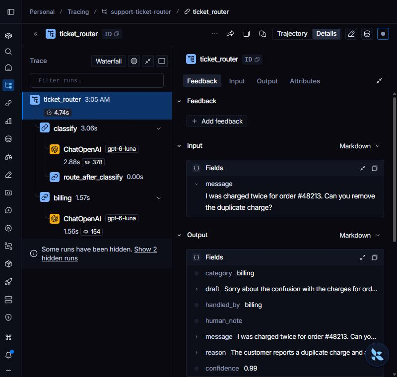

# Support Ticket Router

A LangGraph graph that sorts an online shop's support inbox. Each ticket is classified
with structured output as **billing**, **technical**, **refund** or **general** and sent to
that team's node, which drafts a reply. When the classifier is **not confident enough**,
the graph pauses with `interrupt()` and a person picks the category, optionally leaving a
note for the reply; the graph then resumes into the branch they chose.

Built with LangGraph's `StateGraph`, conditional edges, `interrupt()` and
`Command(resume=...)`, served to LangGraph Studio with `langgraph dev`, and traced in
LangSmith.



## The graph

Drawn from the compiled graph (`graph.get_graph().draw_mermaid()`); Studio renders the
same nodes and edges from the dev server.



The same graph in LangGraph Studio, served by `langgraph dev`. A vague ticket has
stopped at `human_review`, and the interrupt carries what the reviewer needs: the
ticket, the model's guess (`general`), its reason, its confidence (0.25) and the four
categories to choose from.



| Building block | Where it lives |
|---|---|
| `StateGraph` with a `TypedDict` state and a separate input schema | [`graph.py`](src/support_ticket_router/graph.py): `TicketState`, `TicketInput` (Studio's form asks only for `message`) |
| Nodes and edges | `classify`, `human_review`, one node per team |
| Conditional edges (the router) | `route_after_classify` (its `Literal[...]` return type lets Studio draw every target) and `route_by_category` |
| Structured output | `with_structured_output(Classification)` → `{category, confidence, reason}` (OpenAI strict JSON schema) |
| Human review: `interrupt()` | `human_review` pauses with the ticket, the model's guess and its reason |
| Resuming: `Command(resume=...)` | the reviewer's `{"category": ..., "note": ...}`, validated by `response_schema=HumanDecision` |
| Checkpointer + `thread_id` | `InMemorySaver` in the scripts; the server's persistence under `langgraph dev` |
| Studio | `langgraph.json` → graph `ticket_router` |
| Tracing | runs go to the LangSmith project `support-ticket-router` |

### Design decisions

- **The router's return type is the edge list.** `route_after_classify` returns
  `Literal["billing", "technical", "refund", "general", "human_review"]`; without it (or a
  `path_map`) Studio draws the branch nodes unconnected.
- **Nothing with side effects before `interrupt()`.** On resume a node runs again from its
  first line, so `human_review` makes no model call; classification happens in the node
  before it and is not repeated.
- **The resume value is validated.** `interrupt(..., response_schema=HumanDecision)` rejects
  a category that does not exist or a misspelled key (`ValidationError`) and leaves the
  thread paused, so a corrected answer still works. The schema also reaches API clients
  with the interrupt, so Studio can offer a typed form for the answer.
- **A classifier refusal goes to a human; an API error does not.** A refusal or unparsable
  output becomes `confidence = 0.0` and routes to `human_review`; a rate limit or an auth
  error is raised, so it can never pass for an ambiguous ticket.
- **Each ticket starts clean.** `classify` resets the reviewer note, so on a reused thread
  (as in Studio) one ticket's note never reaches the next ticket's reply.
- **The confidence is calibrated in the prompt.** The system prompt defines each category
  and says what 0.9+, 0.4–0.6 and < 0.4 mean, well clear of the 0.7 threshold.
- **The served graph has no checkpointer.** `langgraph dev` refuses to load a module-level
  graph compiled with one, so `build_graph(checkpointer=None)` is a factory and the
  scripts pass `InMemorySaver()`.

## Sample tickets

[`samples/tickets.json`](samples/tickets.json) holds 20 tickets with the route each one
should take. Four are deliberately vague or mix two problems, and carry the decision a
human reviewer would make. `ticket-samples` runs them all and prints *expected / found*.
It is a sanity check, not an evaluation framework.

## Run it

You need Python 3.12 with [uv](https://docs.astral.sh/uv/) and an OpenAI API key. A
LangSmith key is optional; with one, every run is traced.

```bash
git clone https://github.com/brkakyldz/support-ticket-router.git
cd support-ticket-router
cp env.example .env                                    # then fill in OPENAI_API_KEY (and LANGSMITH_API_KEY)
uv sync
uv run ticket-samples                                  # all 20 tickets -> expected / found table
uv run ticket-samples --only T16 T20 --drafts          # a subset, with the drafted replies
uv run ticket-route "Hi, I have a problem with my order."   # one ticket; you are the reviewer
```

### In LangGraph Studio

```bash
uv run langgraph dev
```

Open https://smith.langchain.com/studio/?baseUrl=http://127.0.0.1:2024 in Chrome, signed
in to LangSmith (if Studio says *Failed to fetch*, allow **Local network access** for
smith.langchain.com in the site settings). Submit a vague ticket such as *"This is the
third time I'm writing. Nobody answers. Just fix it."*; the run stops at `human_review`.
Resume it with:

```json
{"category": "general", "note": "Apologise and ask for the original ticket number."}
```

`langgraph dev` reads `.env` once at start-up, so restart it after changing a key.

## Tests and checks

```bash
uv run pytest                                     # 11 tests, no network, tracing off
uv run python scripts/acceptance.py               # end-to-end checks against the real model
uv run python scripts/acceptance.py --server      # + the running dev server (Studio's API)
```

`scripts/acceptance.py --server` against `gpt-6-luna` and a running dev server, on
2026-10-01: **6/6 passed** (full output in
[`docs/acceptance-2026-10-01.txt`](docs/acceptance-2026-10-01.txt)).

| # | Check | Result | Evidence |
|---|---|---|---|
| 1 | The graph has four team branches and `human_review` | PASS | 14 edges: `classify` → 5 targets, `human_review` → 4 branches |
| 1b | The dev server serves the same graph Studio draws | PASS | `/assistants/{id}/graph` returns the 8 nodes and 14 edges |
| 2 | Clear tickets reach the right branch directly | PASS | 16/16, confidence 0.97–0.99 (T19 0.86) |
| 3 | Unclear tickets pause and the human's choice picks the branch | PASS | 4/4 paused at confidence 0.25–0.55 and resumed into the reviewer's branch |
| 3b | Pause and resume through the server API, as Studio does | PASS | thread status `interrupted`, `next = ["human_review"]`, typed resume form `{category, note}`, resumed → `general` |
| 4 | The trace shows the chosen branch | PASS | T01's trace: `ticket_router` → `classify` → `route_after_classify` → `billing` |

T19 (a discount code that did not apply) was first written as an ambiguous ticket, but
the category definitions put price adjustments under billing and the model has classified
it as billing (0.78–0.96) in every run so far, so it is kept in the set as a clear
billing ticket.

The demo at the top is a real terminal session; the seconds spent waiting for the model
are shortened.

## Tracing

Every run goes to the LangSmith project `support-ticket-router`. This is the trace of
the billing ticket from the demo at the top: `classify` makes one structured-output call,
`route_after_classify` sends the ticket straight to `billing` with no human step, and the
root run's output holds the category, the confidence (0.99), the classifier's reason and
the drafted reply. A ticket that pauses is routed to `human_review` instead, and its
team's node runs in a second run on the same thread once the reviewer answers.



## Project layout

```
support-ticket-router/
├── langgraph.json            # graph "ticket_router" for langgraph dev / Studio; reads .env
├── samples/tickets.json      # 20 tickets with expected routes and reviewer decisions
├── src/support_ticket_router/
│   ├── config.py             # .env, LangSmith project, lazy model
│   ├── graph.py              # state, prompts, nodes, routers, build_graph(), graph
│   └── cli.py                # ticket-route (one ticket) and ticket-samples (the table)
├── scripts/acceptance.py     # end-to-end checks
└── tests/test_graph.py       # graph shape, interrupt/resume, validation, failure paths
```

## Scope

The router reads tickets from the command line, the sample file or Studio. It does not
read or send e-mail, store tickets in a database, or send the drafted replies anywhere.

## License

[MIT](LICENSE)
